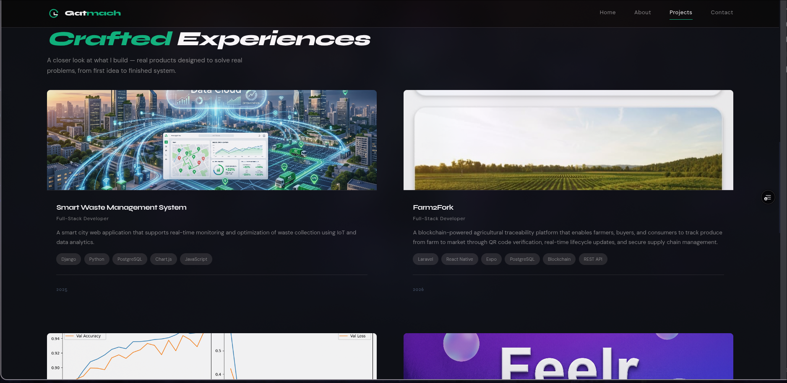
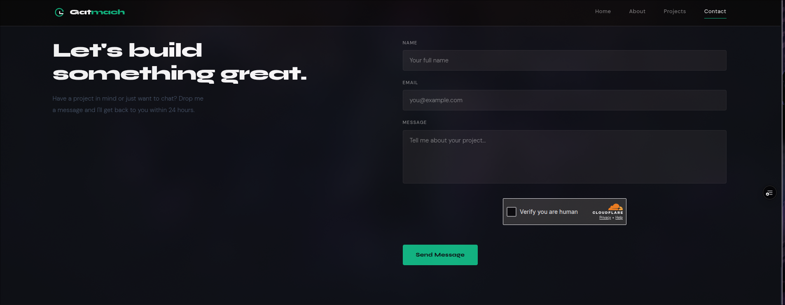
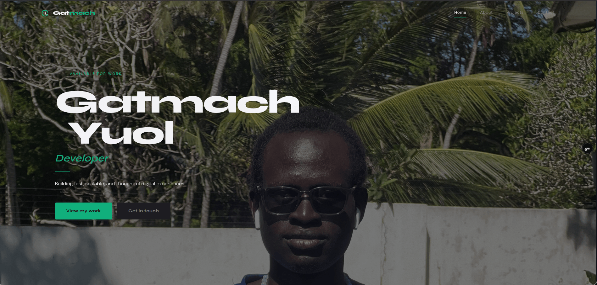
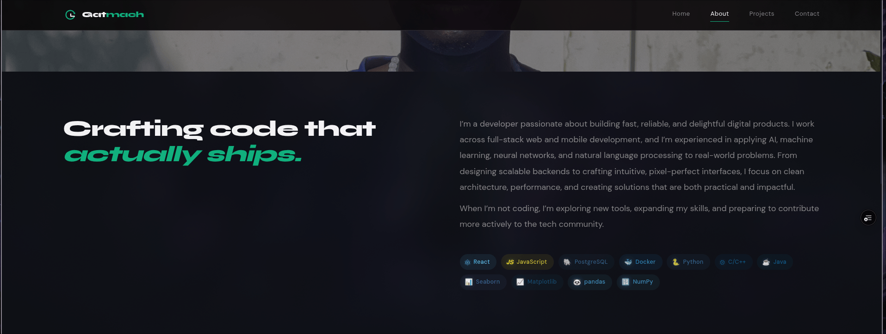

# 💼 Gatmach Yuol — Full-Stack Developer Portfolio

<p align="center">
  
</p>

<p align="center">


</p>

<p align="center">

A modern, responsive, full-stack portfolio website showcasing my projects, technical skills, and professional journey.

Built with **React**, **TypeScript**, **Express**, **PostgreSQL**, **Cloudflare Turnstile**, and deployed using **Vercel** and **Render**.

</p>

---

# 🌐 Live Demo

### Portfolio

> https://my-portfolio-repo-eta.vercel.app/

### Backend API

> https://portfolio-backend-koo9.onrender.com/api/health

---

# ✨ Features

- 🎨 Modern responsive UI
- 🌙 Clean dark theme
- ⚡ Fast Vite build system
- 📱 Mobile-first design
- 🎯 Active navigation tracking
- ✨ Smooth scroll animations
- 📂 Project showcase
- 📧 Secure contact form
- 🛡 Cloudflare Turnstile protection
- 🚦 Express rate limiting
- 🔒 Security headers using Helmet
- 📬 Email delivery using Nodemailer
- 🌐 REST API backend
- 🚀 CI-ready GitHub Actions workflow
- 🧹 ESLint + Prettier + Husky configuration

---

# 🛠 Tech Stack

## Frontend

| Technology | Purpose |
|------------|---------|
| React 18 | UI Library |
| TypeScript | Type Safety |
| Vite | Build Tool |
| CSS Modules | Component Styling |
| React Hooks | State Management |

---

## Backend

| Technology | Purpose |
|------------|---------|
| Node.js | Runtime |
| Express | REST API |
| TypeScript | Type Safety |
| Nodemailer | Email Service |
| PostgreSQL | Database |
| Cloudflare Turnstile | Spam Protection |

---

## Deployment

| Service | Purpose |
|----------|---------|
| Vercel | Frontend Hosting |
| Render | Backend Hosting |
| GitHub | Version Control |

---

# 📸 Screenshots

## 🏠 Home

<p align="center">

</p>

---

## 👨‍💻 About

<p align="center">

</p>

---

## 🚀 Projects

<p align="center">

</p>

---

## 📬 Contact

<p align="center">

</p>

---

<details>

<summary><strong>📷 View Full Resolution Screenshots</strong></summary>

### Hero



---

### About



---

### Projects


---

### Contact


</details>

---

# 📂 Project Structure

```text
portfolio/
│
├── client/                 # React frontend
│   ├── src/
│   ├── public/
│   └── vite.config.ts
│
├── server/                 # Express backend
│   ├── src/
│   └── routes/
│
├── screenshots/
│
├── package.json
└── README.md
```

---

# ⚙ Installation

## Clone the repository

```bash
git clone https://github.com/Gatmach/my-portfolio-repo.git

cd my-portfolio-repo/portfolio
```

---

## Install dependencies

```bash
npm install
```

---

# 🔐 Environment Variables

## Client (`client/.env`)

```env
VITE_API_URL=https://portfolio-backend-koo9.onrender.com

VITE_TURNSTILE_SITE_KEY=YOUR_SITE_KEY
```

---

## Server (`server/.env`)

```env
DATABASE_URL=YOUR_DATABASE_URL

PORT=5000

CLIENT_URL=http://localhost:5173

EMAIL_USER=YOUR_EMAIL

EMAIL_PASS=YOUR_APP_PASSWORD

TURNSTILE_SECRET_KEY=YOUR_SECRET_KEY
```

---

# 🚀 Running the Project

Start frontend and backend together

```bash
npm run dev
```

---

## Frontend only

```bash
npm run dev --workspace=client
```

---

## Backend only

```bash
npm run dev --workspace=server
```

---

# 📦 Build

Build the complete project

```bash
npm run build
```

---

# 🧹 Code Quality

Lint

```bash
npm run lint
```

Format

```bash
npm run format
```

---

# 🚀 Deployment

## Frontend

Hosted on **Vercel**

```bash
vercel
```

---

## Backend

Hosted on **Render**

Build Command

```bash
npm run build
```

Start Command

```bash
npm start
```

---

# 🔒 Security

This project includes:

- Cloudflare Turnstile
- Helmet
- Rate Limiting
- Secure CORS
- Environment Variables
- Compression
- Input Validation

---

# 📈 Future Improvements

- Blog section
- Dark / Light theme
- Analytics Dashboard
- Downloadable Resume
- Custom Domain
- Project Search:
- API Documentation

---

# 👨‍💻 Author

## Gatmach Yuol

Computer Science Graduate | Full-Stack Developer | AI & Data Enthusiast

### GitHub

https://github.com/Gatmach

### LinkedIn

https://www.linkedin.com/in/gatmachyuolnyuon

---

# 📄 License

This project is licensed under the **MIT License**.

See the **LICENSE** file for more information.

---

<p align="center">

⭐ If you found this project interesting, consider giving it a star on GitHub.

</p>